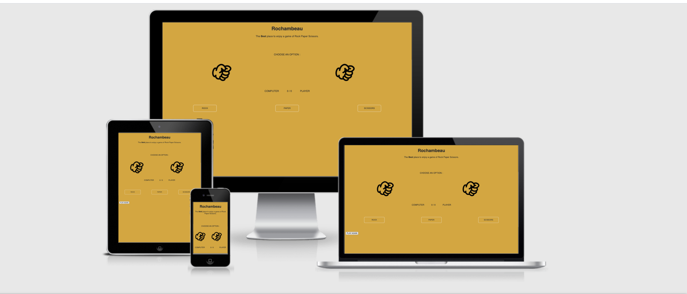
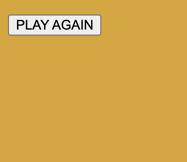
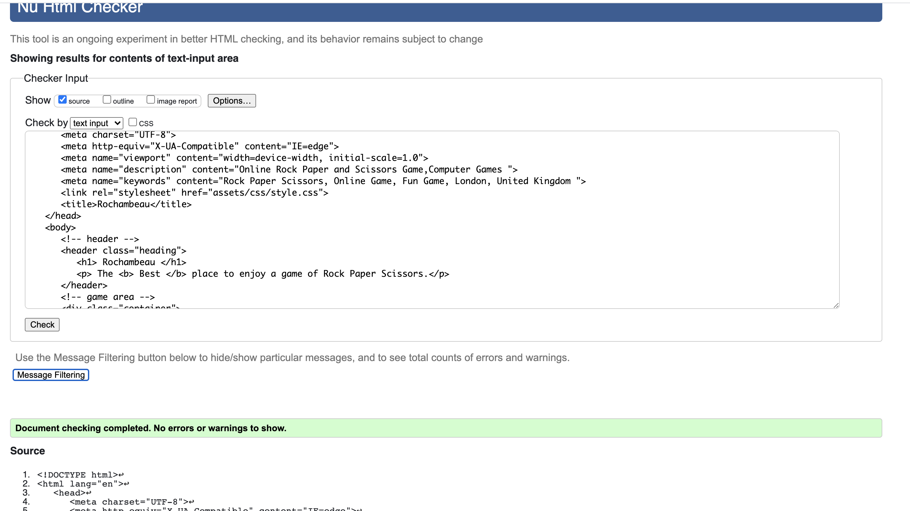
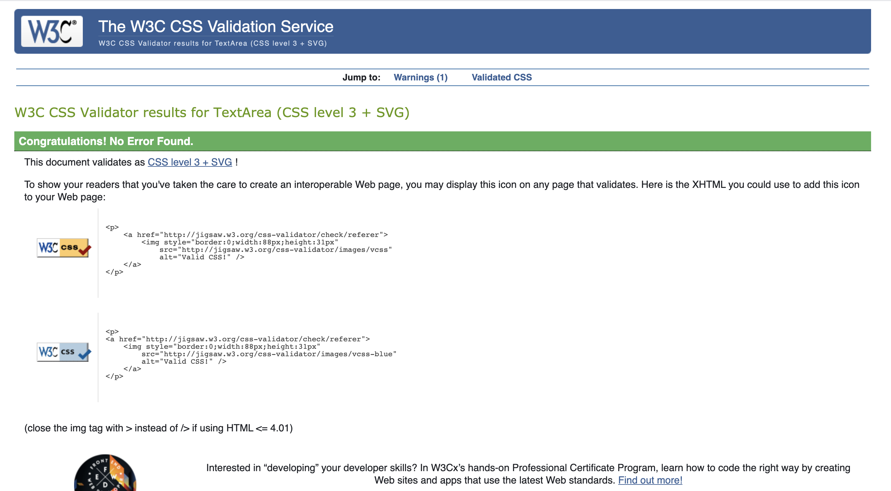
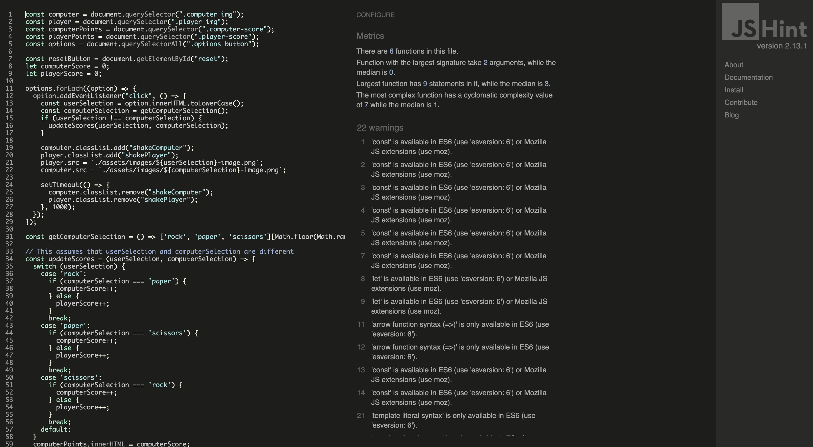

#   Rochambeau

View the live site [here](https://ibrahimali31.github.io/Rochambeau/) 

Image made using [Am I responsive](http://ami.responsivedesign.is/)

## Project Overview 

Rochambeau is a website that provides a fun and quick way for users who love a game of Rock Paper Scissors otherwise known as Rochambeau to play the famous game.This site has been designed in a clear and specific way for the user which provides 
a great expereince for the user.As Rock Paper and Scissors is such a famous game which anyone can understand and play there is not a specific target audience which is great as it can open the doors for a wide varitety of people to enjoy.

This website is designed for people who want to take a few miniutes out of their busy lives to play against a computer.
This is of course a random game which makes the game very enjoyable and very compelling.It is a site which hopes to demonstrate how pure JavaScript works in a real-world context.This site has been created as part of my Portfolio Project 2 for Code Institute.

## Features 

### Existing Features

* The Main Heading 

The main heading shows the name of our website and also a catchy slogan.Its at the top 
of the page and one of first things that the user will see .It provides the user with a
nice and confident feeling that this is the best site to play Rock Paper Scissors .

* The Game Area

If its not the name of the website you will see,then it will definetly be the score area.This 
area should jump up to the users face and is a really cool and interactive area which the user
will enjoy.It consits of the different rock paper scissor images as well as the score area and 
very importantly options menu.This is where the user will have the most interaction with so it 
is important that it is very clean simple and also fun to use for the user to use.

Once of the three options are clicked the images will do a shaking motion (as done in real life when
playing the game) and the javascript will choose a  random option for the computer and this will reflect 
on the scoreboard.All three sections work well in tandem and should be very clear for the user to function
and understand.

* The Reset Button 

The reset button is just a simple way to clear to the beggining.Its very important that the user has this option
because they might want to start from an even beggining.

### Features Left to Implement 

* Create a Rounds of the game

## Testing 

* To test the HTML code, I used the W3C Markup Validation Service:

 This provided me with no errors.

* To test the CSS code, I used the W3C CSS Validation Service:

 This provided me with no errors.

 

 * To test the Javascript code, I used the JSHint Validation Service:

   

   No errors were detected in the code. Warnings were detected in the code however this was due to the use of the new ES6 syntax in the code.

  * Chrome Developer Tools was also used to test on Mobile and Desktop and i was provided with a high score.

  

  ## Deployment

  The project was developed using GitPod and was deployed via the GitHub repository to GitHub Pages.

  1.  Click 'Settings' from the GitHub repository.
  2.  Click 'Pages' from the options available on the left-hand side.
  3.  In GitHub Pages section, under the 'Source', select 'master' from the dropdown
  4.  This will change the branch to 'master', then click 'Save' and this will generate the URL.
  5.  Refresh the page and the site is published and ready to be used.
  6.  Click on the URL for and confirm it has been published.

  ### Clone Project 

  1. Select the 'Repository' for the project from the GitHub dashboard.
  2. Select the 'Code' button. 
  3. From the dropdown :
  - To clone the repository using HTTPS, under "Clone with HTTPS", select the copy icon next to the link.
  - To clone the repository using an SSH key, click Use SSH, then click the copy icon next to the link.
  - To clone a repository using GitHub CLI, click Use GitHub CLI, then click the copy icon next to the link.

  4. Open The Terminal.
  5. Change the current working directory to the location where you want the cloned directory.
  6. Type the git clone, and then paste the URL you copied earlier.
  7. Press Enter to create your local clone.

  ## Running Project Locally

  1. Click the 'Repository' for the project from the GitHub dashboard.
  2. Select the 'Code' button,from the dropdown select 'Download ZIP'.
  3. Withdraw the downloaded ZIP file on your computer.
  4. Open the folder with the files and then open 'index.html' file in the web browser.

  ## Credits 

  - [Noun Project](https://thenounproject.com/) were used for Rock Paper Scissor images.
  - [Google Fonts](https://fonts.google.com/) were used for my word styling.

